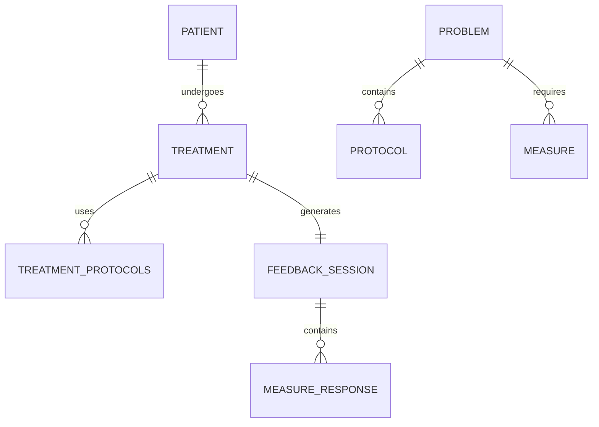

# Brainstorm: Automated Patient Feedback Loop

This document outlines the requirements and proposed technical solution for an automated feedback system following patient treatments.

## 1. Requirement Summary

### Phase A: Setup & Collection
- **Admin**: Defines `Problems`, `Protocols` (linked to problems), and `Measures` (linked to problems).
- **Measures Types**:
    - **Scale**: Number scale (min/max).
    - **Category**: Selection from a list of strings.
- **Intake**: Caretaker selects `Problems` for a patient medical record.

### Phase B: Treatment & Documentation
- **Treatment Execution**: Caretaker treats the patient and documents which `Protocols` were actually used.
- **Completion**: Treatment record is saved in Firestore.

### Phase C: Automated Outreach
- **Trigger**: The day following a treatment, an automated email is sent to the patient.
- **Content**: A unique URL that identifies the specific treatment/session.

### Phase D: Patient Feedback
- **Form UI**: Displays patient details, treatment timestamp, and a list of measures.
- **Logic**: Measures shown are restricted to those related to the problems/protocols addressed in that specific treatment.
- **Submission**: Patient submits Scale or Category answers.

### Phase E: Automatic Consumption
- **Update**: Responses are automatically saved to the database, attributed to the patient and treatment.

---

## 2. Proposed Technical Solution

### A. Data Architecture

We should expand the schema to ensure traceability:



### B. Automation Strategy (The "Engine")

#### 1. Tracking Treatments
We need a `treatments` collection that stores:
- `patientId`, `caretakerId`, `timestamp`
- `protocolIds` (array of protocols performed)

#### 2. Scheduled Job (The "Follow-up")
Instead of a real-time trigger, we'll use a **Scheduled Cloud Function** (CRON job) that runs daily (e.g., at 09:00 AM).
- **Logic**: 
    1. Query all `treatments` where `timestamp` was yesterday.
    2. For each treatment, create a `feedback_sessions` document.
    3. Generate a unique, short-lived token or ID for the session.
    4. Trigger an email via **Firebase Trigger Email Extension** or a direct **SendGrid/Mailgun API** call.

#### 3. The Patient Link
The email URL would look like: `https://apitherapy.app/feedback/[SESSION_ID]`

---

## 3. Security Architecture (The "Safe-Public" Strategy)

The patient does not need to "log in" (username/password), but they are securely authorized using **Token-Based Access**.

### A. How it Works
1. When a treatment is recorded, a unique `sessionId` (e.g., `Rf91_b2x7_mPz4`) is generated.
2. The email contains a link like `apitherapy.app/feedback/Rf91_b2x7_mPz4`.
3. The randomness of this ID makes it unguessable and secure.

### B. Firestore Security Rules (Wildcards)
We use a **Wildcard Pattern** in the security rules. You don't write a rule for every session; you write one generic rule that applies to all of them:

```javascript
// This is a GENERIC rule pattern
match /feedback_sessions/{sessionId} { 
  // '{sessionId}' is a wildcard variable. 
  // It represents whatever ID the patient clicked in their email.
  
  // 1. Allow READ if they have the ID, but ONLY if 'status' is 'pending'
  allow get: if resource.data.status == 'pending';

  // 2. Allow UPDATE ONLY to set the responses and mark as 'completed'
  allow update: if resource.data.status == 'pending' 
               && request.resource.data.status == 'completed'
               && request.resource.data.diff(resource.data).affectedKeys().hasOnly(['responses', 'status', 'completedAt']);
}
```

---

## 4. Implementation Proposal

### Phase 1: Infrastructure
- Set up `measures` and `treatments` collections in Firestore.
- Configure Firebase Email Extension.

### Phase 2: Caretaker UI
- Update Treatment Form to allow checking off which protocols were used.

### Phase 3: Automation
- Implement the "Next Day" Cloud Function.
- Create the `/feedback` route with a "No-Auth-Required" view (secured by the unique session ID).

### Phase 4: Data Integration
- Create a dashboard view for caretakers to see the aggregated feedback (Measures vs. Protocols) to visualize effectiveness.

---

## 5. Layout & Experience (Zero-Knowledge UI)

The patient should see **only** what they need to read and act on. They do not need to know anything about the app's internal structure, branding (beyond the header), or other patients.

- **Standalone View**: When accessed via a feedback link, the UI will toggle into a "Standalone Mode."
- **Sidebar Suppression**: The standard `Sidebar` component will be completely hidden.
- **Center-Focused Layout**: The form will be centered in a clean, professional "Card" interface.
- **Header**: Only the clinic name and patient's greeting (e.g., "Hello [Name], please let us know how you feel") will be shown.
- **Language Detection**: The form will automatically load in the language specified in the `feedback_session`.

---

## 6. Detailed Design Guidelines (For Implementation)

These guidelines are designed to be followed by a human developer or an AI agent in a future session.

### A. Data Schema Details
- **`measures` Collection**:
  - `id`: Unique slug (e.g., "pain_intensity").
  - `name`: String (Localizable).
  - `type`: Enum (`scale` | `category`).
  - `config`: 
    - For `scale`: `{ min: number, max: number, labels?: { min: string, max: string } }`.
    - For `category`: `{ options: string[] }`.
- **`feedback_sessions` Collection**:
  - `id`: Random secure token (NanoID).
  - `treatmentId`: Reference to the treatment record.
  - `patientId`: Reference to the patient.
  - `language`: String (e.g., "he", "en"). Determined by the Caretaker's language (fallback) or the Patient's language (preferred).
  - `measures`: Array of Measure IDs to be asked.
  - `status`: Enum (`pending` | `completed` | `expired`).
  - `responses`: Map where key is `measureId` and value is the patient's answer.

### B. Automation Logic (Cloud Function)
- **Email Dispatch (Daily at 9 AM)**: 
  - `0 9 * * *`.
  - **Grace Period**: Ensure the treatment was completed at least 12 hours ago.
  - **Idempotency**: Check if a session for `treatmentId` already exists.
  - **Language Selection Logic**:
    1. Check if the Patient has a `preferredLanguage` set.
    2. If not, use the Caretaker's `preferredLanguage`.
    3. Use this language to select the correct Email Template and populate the `session.language` field.
- **Data Retention & Cleanup (Daily at 3 AM)**:
  - `0 3 * * *`.
  - **Logic**: Deletes all `feedback_sessions` documents where:
    - `status == 'pending'`
    - AND `createdAt` is older than the **Configured Expiry Interval** (e.g., 7 days).
  - **Goal**: Prevents the database from filling up with unanswered, expired links and ensures that "Dead" tokens are removed from the system.

### C. Frontend Implementation
- **Routing**: Since the app currently uses state-based viewing (`App.tsx`), we need to detect the URL on load.
  - *Recommendation*: Use `react-router-dom` or a simple `window.location.pathname` parser in `App.tsx`'s `useEffect` to set `currentView` to `patient_feedback`.
- **Automatic Localization**: The component will use `i18n.changeLanguage(session.language)` immediately upon loading the session data to ensure the UI translates correctly.
- **State Management**:
  - Store the `sessionId` in local state.
  - Disable the "Submit" button as soon as it is clicked to prevent double-submission.
  - Show a "Thank You" success state that cannot be navigated away from.

### D. Security Rules Implementation
```javascript
// Example Final Rule
match /feedback_sessions/{sessionId} {
  allow get: if resource.data.status == 'pending';
  allow update: if resource.data.status == 'pending' 
               && request.resource.data.status == 'completed'
               && request.resource.data.completedAt != null;
}
```

---

## 7. Required Configuration Settings (Admin)

To make the system flexible, the following settings should be added to the Admin Configuration:

1.  **Feedback Expiry Interval**: Number of days a link remains valid before being purged (e.g., 7 days).
2.  **Email Template ID**: The SendGrid/Firebase Email template to use for the outreach.
3.  **Clinic Display Name**: The name to show in the standalone header.
